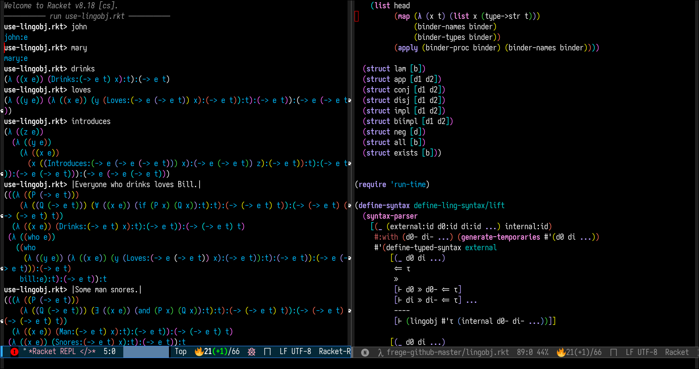

#+TITLE: Frege, montagoid natural language semantics, implemented in Racket Scheme
#+OPTIONS: toc:nil num:nil

* Overview
#+begin_export html

  

#+end_export
A prototype for an implementation of a Montagovian semantics in Racket, realising a compositional derivational typed semantics for natural language.

(Active development moved here from the original [[https://gitlab.com/emacsomancer/frege/][GitLab forge repository]].)

* Basic Usage
Run =use-lingobj.rkt= in Racket, which defines number of example linguistic objects.

Currently semantic expressions are composed using a lisp-like^{[[#footnote-1]]} syntax. So ⟦Mary snores⟧ can be expressed as =(mary snores)= or =(snores mary)=; the denotation of ⟦Mary loves Bill⟧ as =(mary (loves bill))= or =((loves bill) mary)= or =(mary (bill loves))= or =((bill loves) mary)=.

You can form arbitrary expressions including lambdas, e.g. λxλy[Snore(x) ∧ Snore(y)] is currently represented in Frege as:

#+begin_src racket
(λ ([x e]) (λ ([y e]) (and (snores x) (snores y))))
#+end_src

And λP∈D_{<e,t>}[P(b)] as:
#+begin_src racket
(λ ([P (-> e t)]) (P bill))
#+end_src

Frege currently checks to make sure that the composition of elements is valid according to the types of the elements, thus the following –  equivalent to λP∈D_{<e,t>}[P(b)](m) – produces an error:

#+begin_src racket
> ((λ ([P (-> e t)]) (P bill)) mary)

; #%app: mismatch: left=(-> (-> e t) t) right=e
#+end_src

** Screenshots

** Types
Currently types are represented in a lisp-like syntax (the Frege =->= is equivalent to the standard "," but in prefix notation). Here are some equivalences:
|---------------------------+-------------------------------|
| Montagoid Lambda Calculus | Frege                         |
|---------------------------+-------------------------------|
| <e, t>                    | (-> e t)                      |
|---------------------------+-------------------------------|
| <e, <e, t>>               | (-> e (-> e t))               |
|---------------------------+-------------------------------|
| <e, <e, <e, t>>>          | (-> e (-> e (-> e t)))        |
|---------------------------+-------------------------------|
| <<e,t>,<<e,t>, t>>        | (-> (-> e t) (-> (-> e t) t)) |
|---------------------------+-------------------------------|

_[[#ref-1][^]] [1] Lisp-*like*: there is no requirement that the first element in an evaluated expression be a procedure._
